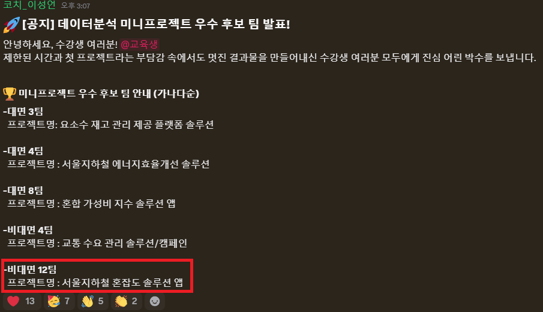

# 이어드림스쿨6기-미니프로젝트1차-데이터분석프로젝트

## 프로젝트 개요

- 팀명: 비대면12팀-4코어 12스레드
- 팀원: 황윤찬, 허정모, 김휘
- 주제: 서울 지하철 혼잡도 분석 및 앱 서비스 기획
- 프로젝트 일정: 2026. 06. 25(목) ~ 2026. 06. 26(금)

## 팀내 본인 주요 역할

- 2015-2021 서울 지하철 승하차 데이터 분석

## 평가 결과

- 수상 결과: TOP5 이내 진입



## 평가 기준

| 평가 항목 | 핵심 내용 |
| --- | --- |
| SCQA | 데이터 분석 문제 정의 |
| 피라미드 근거 | 통계 분석 정리(t-test, ANOVA, 회귀분석 등) |
| 시각화 자료 | 분석 결과를 명확하게 전달하는 그래프와 표 |
| Action Plan(So What?) | 분석 결과 기반 실행 방안 제시 |

## 프로젝트 목적

서울 지하철 승하차 인원 데이터와 역 위치 데이터를 활용해 시간대, 노선, 역별 유동량 패턴을 분석하고, 혼잡 완화와 이용자 편의를 위한 앱 서비스 기획 방향을 도출한다.

현재 데이터만으로는 실제 열차 내부 혼잡률을 계산할 수 없으므로, 본 프로젝트에서는 `승차인원 + 하차인원`으로 계산한 시간대별 유동량을 혼잡도 대리 지표로 사용한다.

## 활용 데이터

| 데이터 | 설명 | 비고 |
| --- | --- | --- |
| `dataset/Seoul_subway_data_20210705.csv` | 서울 지하철 월별, 역별, 시간대별 승하차 인원 데이터 | 인코딩 `cp949` |
| `dataset/subway_location_data.csv` | 서울 지하철 역 위치 데이터 | 인코딩 `utf-8-sig` |

## 분석 기준

- 시간대별 유동량: 시간대별 승차인원 + 시간대별 하차인원
- 역별 월간 유동량: 모든 시간대 승차인원 + 하차인원 합계
- 출근 피크: `07시-08시`, `08시-09시`, `09시-10시`
- 퇴근 피크: `17시-18시`, `18시-19시`, `19시-20시`
- 혼잡도 지수: 특정 역/시간대 유동량을 전체 또는 노선 내 최대값으로 나눈 값

## 분석 과정 로드맵

1. 데이터 로드
2. 데이터 검증
3. 결측치, 중복, 이상값 확인
4. 시간대별 승하차 컬럼 long format 변환
5. 역명 정규화 및 위치 데이터 결합
6. 월별, 노선별, 역별, 시간대별 유동량 탐색
7. 출근/퇴근 피크 혼잡도 비교
8. 좌표 기반 시각화
9. 통계 분석 및 효과크기 확인
10. 앱 서비스 기획 방향 도출

## 주요 분석 질문

- 서울 지하철의 전체 유동량은 기간별로 어떤 추세를 보이는가?
- 혼잡도가 높은 노선과 역은 어디인가?
- 출근 피크와 퇴근 피크의 혼잡 패턴은 어떻게 다른가?
- 혼잡도가 높은 역의 위치적 특성은 무엇인가?
- 분석 결과를 바탕으로 어떤 앱 서비스 기능을 기획할 수 있는가?

## 저장소 구조

```text
.
├── AGENTS.md
├── README.md
├── 명저마스터_요청사항.md
├── dataset
│   ├── Seoul_subway_data_20210705.csv
│   └── subway_location_data.csv
├── reference
│   ├── SCQA, 피라미드 원칙.pdf
│   ├── 기초통계이론.pdf
│   └── 시각화교안.pdf
├── outputs
│   ├── subway_congestion_analysis_presentation.pptx
│   ├── subway_congestion_analysis_presentation_v2_map_reflected.pptx
│   ├── subway_congestion_analysis_presentation_v3.pdf
│   ├── subway_congestion_analysis_presentation_v3.pptx
│   └── 지하철_승하차_혼잡도분석_보고서.ipynb
├── Team_report
│   ├── 서울_지하철_혼잡도_분석_15~26.pptx
│   └── notebook
│       ├── 김휘_지하철_승하차_혼잡도분석_보고서.ipynb
│       ├── 서울지하철_혼잡도_통합분석_2015-2026.ipynb
│       ├── 제출용_colab_data.zip
│       ├── 허정모_서울시 지하철 혼잡도 분석 및 안전 대응 전략 및 분석.ipynb
│       └── 황윤찬_서울지하철혼잡도_분석.ipynb
├── 서울_지하철_혼잡도_분석_팀결과물.pdf
└── 지하철_승하차_혼잡도분석_보고서_개인결과물.ipynb
```

## 산출물

- 개인 분석 보고서: `지하철_승하차_혼잡도분석_보고서_개인결과물.ipynb`
- 팀 최종 PDF 결과물: `서울_지하철_혼잡도_분석_팀결과물.pdf`

## 회의 및 작업 내용

| 날짜 | 내용 |
| --- | --- |
| 2026. 06. 25 | 프로젝트 주제 선정, 데이터 확인, 분석 방향 논의 |
| 2026. 06. 25 | 데이터 전처리, 역명 정규화, 기본 탐색적 분석 |
| 2026. 06. 26 | 혼잡도 분석, 시각화, 통계 분석 |
| 2026. 06. 26 | 앱 서비스 기획, 발표 자료 및 최종 보고서 작성 |

## 앱 서비스 기획 방향

- 시간대별 혼잡 예측 및 안내
- 혼잡도가 높은 역과 시간대 알림
- 출근/퇴근 피크 시간 회피 추천
- 역 위치 기반 혼잡 지도 제공
- 혼잡도 완화를 위한 대체 이동 시간대 제안

## 한계점

- 본 프로젝트의 혼잡도는 실제 열차 내부 혼잡률이 아니라 승하차 유동량 기반 대리 지표이다.
- 차량 정원, 운행 횟수, 배차 간격, 승강장 면적 데이터가 없어 실제 혼잡률 계산은 확인 필요하다.
- 위치 데이터의 `x좌표`, `y좌표` 의미는 샘플상 위도와 경도로 보이나 원천 데이터 문서 확인이 필요하다.
- 역명 정규화 과정에서 동일 역명, 환승역, 위치 데이터 중복에 대한 추가 검토가 필요하다.
